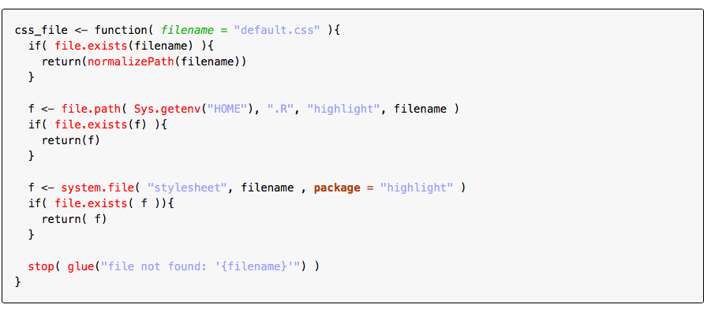
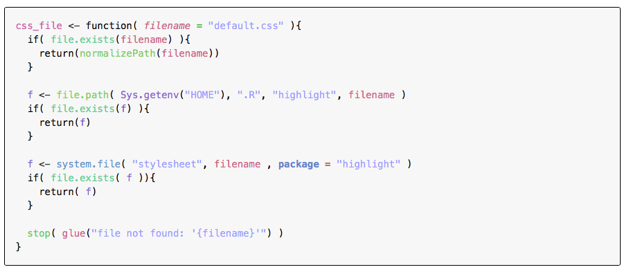

# highlight

highlight is a syntax highlighter for R code.

## Installation

You can install highlight from github with:

``` r
# install.packages("devtools")
devtools::install_github("romainfrancois/highlight")
```

## Typical highlighting (lestrade)

Typical syntax highlighting is only interested in whether a token is a
function call, a keyword, a string, … this is what the `lestrade`
detective does:

``` r
library(highlight)
highlight( file = "css_file.R", detective = lestrade )
```

This will look like this:



This differentiates <span class="functioncall">function calls</span>,
<span class="symbol_formalargs">formal arguments</span>,
<span class="symbol_argument">used arguments</span> … because `lestrade`
identified these tokens as such.

## semantic highlighting (sherlock)

Traditional highlighting only reveals the obvious, so the package also
benefits from the investigation of `sherlock` for semantic highlighting.
In semantic highlighting, every symbol gets a different color.

``` r
highlight( file = "css_file.R", detective = sherlock )
```



With this we can quickly skim through the file and see e.g. the
different uses of `filename`.

## In rmarkdown

To use in `rmarkdown` you can use the `hl_hook_source` and
`hl_hook_document` hooks. Unfortunately this does not work for README on
github so this document uses screenshots.

``` r
knitr::knit_hooks$set( 
  source = hl_hook_source, 
  document = hl_hook_css
)
```
